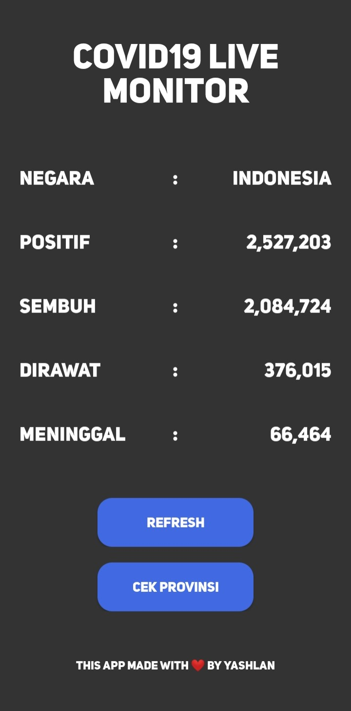

## Covid19 Live Indonesia
 
app untuk monitoring kasus covid 19 di indonesia dan provinsi-provinsinya. semua data-datanya diambil dari > api.kawalcorona.com <

## API

```
https://api.kawalcorona.com/
```
## Library Retrofit

```
implementation 'com.squareup.retrofit2:retrofit:2.9.0'
implementation 'com.squareup.retrofit2:converter-gson:2.9.0'  
```
## Download APK

cari di release, atau bisa juga pergi ke > Covid19LiveMonitor/app/release/Covid19Indonesia.apk > pencet Download 

## Screen Shoot
   

